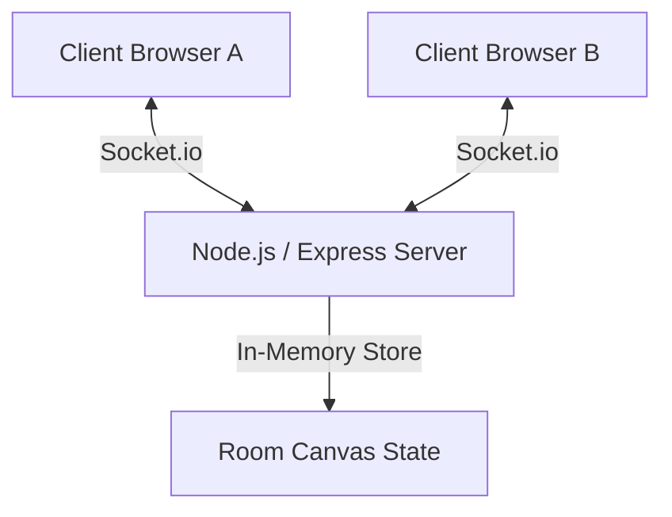

# InkSync Implementation Plan

This document outlines the architecture, design choices, and file changes required to complete the InkSync real-time collaborative drawing application. It focuses on the core project requirements, ignoring temporary sprint boundaries to provide a single, unified development path.

---

## 🏗️ System Architecture & Real-Time Flow

InkSync is a real-time collaborative web application structured with a clean separation of concerns:

### 1. Backend Server (`server.js`)
*   **Signaling & Relay:** A Node.js Express server integrated with Socket.io. The server is responsible for routing drawing events and client metadata within isolated rooms.
*   **Room Management:** Keeps track of active rooms and their clients in-memory. Uses `socket.join(roomId)` to restrict emissions to peers in the same room.
*   **Canvas State Buffering:** To solve the "cold join" problem (where a newly joined user sees a blank canvas), the server will store a buffer of drawing actions for each room in-memory. Upon joining, this buffer is sent to the client to reconstruct the current drawing state.
*   **Event Map:**
    *   `join-room`: Client joins a room namespace. Receives canvas history.
    *   `draw-start`: Client begins a stroke. Relayed to other peers in the room.
    *   `draw-move`: Client draws a path segment. Relayed to other peers in the room.
    *   `draw-end`: Client finishes a stroke. Relayed to other peers.
    *   `clear-canvas`: Wipes canvas. Clears history on server, broadcasts clear signal.
    *   `cursor-move`: Broadcasts client cursor coordinate (`x`, `y`) for real-time multiplayer cursor rendering.

### 2. Client Application (`public/app.js`)
*   **SPA Client-Side Router:** Listens to URL changes (using `window.location.pathname` and `history.pushState`). 
    *   `/` shows the landing page.
    *   `/rooms/:roomId` hides the landing page, shows the drawing workspace, and initializes the socket connection.
*   **Smooth Canvas Rendering:** Interpolates raw pointer movements using **Quadratic Bezier Curves** (`ctx.quadraticCurveTo()`) to guarantee smooth strokes even under mouse lag.
*   **Multi-User Canvas Merging:** Merges incoming remote stroke commands dynamically without interrupting the local user's active stroke.
*   **Multiplayer Cursors:** Renders absolute-positioned elements over the canvas workspace showing remote collaborators' cursors with distinct colors and user badges.

---

## 🎨 Claymation-meets-data UI Design System

In accordance with [DESIGN.md](file:///home/aditya/Documents/Projects/InkSync/DESIGN.md), the drawing workspace will adapt the **Clay** design theme:
1.  **Canvas floor:** Warm cream canvas background (`#fffaf0`) for the app workspace.
2.  **Typography:** Bold Inter weights (500–600) with tight letter-spacing for controls and title badges.
3.  **Color accents:** Controls and tool settings styled in a 6-color saturated palette (Pink `#ff4d8b`, Teal `#1a3a3a`, Lavender `#b8a4ed`, Peach `#ffb084`, Ochre `#e8b94a`, Cream card `#f5f0e0`).
4.  **Generous rounding:** Rounded tools panels, action buttons, and inputs matching the soft, clay-like aesthetic (`12px` to `24px` border radius).
5.  **Multi-user indicators:** Active users shown in a stack of overlapping colored avatar bubbles.

---

## 🛠️ File-by-File Modification Details

### 1. `package.json` [MODIFY]
*   Add `socket.io` to the dependencies (v4.x) to support real-time room communication.
*   *Note:* User rules prohibit running terminal scripts; the package will be added directly to the file for automatic configuration during the user's manual installation step.

### 2. `server.js` [MODIFY]
*   Wrap Express server with Node `http` server.
*   Initialize Socket.io on the HTTP server.
*   Implement room joining logic and in-memory canvas stroke history.
*   Serve `index.html` catch-all for SPA compatibility.

### 3. `public/index.html` [MODIFY]
*   Add a new viewport block for the `#drawing-workspace` overlay (hidden by default).
*   Add drawing controls markup:
    *   **Toolbar:** Pen, Eraser, Clear, Undo, Redo.
    *   **Color Picker:** Set of custom Clay-palette buttons plus standard HTML input.
    *   **Brush Size Slider:** Numeric and slider range tool.
    *   **Invite Badges:** Button to copy the current URL invite link.
    *   **Collaborator Cursors Container:** Target wrapper for rendering active user avatars and tags.

### 4. `public/styles.css` [MODIFY]
*   Add styles for the SPA routing transition (show/hide landing vs workspace).
*   Style the Workspace UI: floating sidebar/bottom-bar controls using generous border-radii and Clay colors.
*   Style remote cursor tags and animated paths.
*   Ensure drawing workspace layout is responsive (e.g., collapsible sidebars on mobile viewports).

### 5. `public/app.js` [MODIFY]
*   Implement routing logic using `popstate` and path parsing.
*   Implement HTML5 Canvas input listeners supporting both mouse and pointer/touch events.
*   Implement curve smoothing logic (calculating middle points of coordinates for Bezier rendering).
*   Add local actions: tool toggle, custom colors, brush size, local undo/redo stacks.
*   Add WebSocket connections: emit draw commands and render remote draw streams on receipt.
*   Track and render cursor updates.

---

## 📈 Verification Plan (Manual)

As per developer rules, all verification will be handled manually by the user:
1.  **Dependency Install:** Run `pnpm install` / `npm install`.
2.  **Server Run:** Start the server with `npm start` and visit `http://localhost:3000`.
3.  **Local Workspace Test:** Navigate to a room (e.g. `/rooms/demo-room`), check drawing tools (brush, eraser, size control, undo/redo).
4.  **Real-Time Collaborative Test:** Open a second private window or separate browser, join the same room URL, and verify real-time strokes and cursor tracking synchronize correctly in under 100ms.
5.  **Export & Clear:** Click download to verify high-res PNG creation, and clear to verify canvas wipe broadcasts to all clients.
